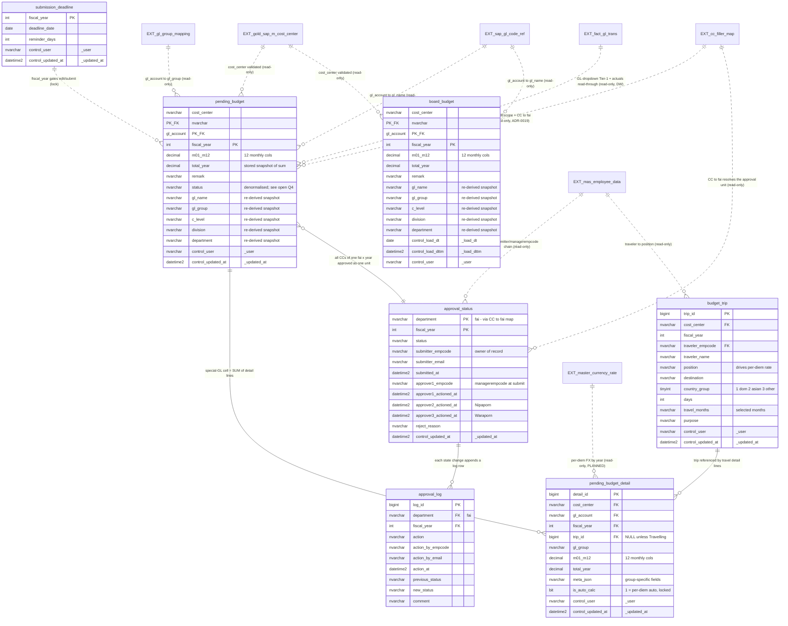

# Budget Management Web — Transactional Data Model (`budget.*`)

Target: **Microsoft Fabric SQL Database**, schema namespace **`budget`**.
Scope: the 7 transactional budget tables for the main app (submission + approval, Phase-1).
Out of scope: dashboard (Phase 2), email-notification tables (deferred).

This model implements decisions already made in the ADRs; it does not re-decide them.
Authority: ADR-0003 (two aligned wide tables), **ADR-0008 (approval unit = ฝ่าย ×
fiscal_year — supersedes ADR-0003's CC × year)**, ADR-0005 (special-GL detail layer +
trip linkage), **ADR-0019 / ADR-0004 (RLS via the CC↔Filler map + Entra identity —
supersedes ADR-0001's orgcode chain)**, **ADR-0020 (SAP actuals read-through from the
DW `fact_gl_trans`)**, **ADR-0021 (board_budget ingested as a yearly Excel file dropped
on SharePoint)**, CONTEXT.md (ubiquitous language), .claude/project-context.md
(Phase-1 scope, special-GL behaviour, GL-dropdown tiers, per-diem engine).

> **Reconciled 2026-07-12** — this file originally predated ADR-0008/0018/0019/0020/0021;
> the approval-unit key, RLS source, SAP source, and board_budget ingest path below have
> been updated to match them.

Supersedes `db/schema.sql` (Azure-SQL, division-based 4-level chain). That file is mined for
column ideas only — `user_division_map` and the division-keyed `approval_status` are dropped.

---

## 1. Source inventory

### 1a. Tables this model OWNS (schema `budget`, written by the app)

| Table | Grain (PK) | Purpose | Lifecycle |
|---|---|---|---|
| `budget.pending_budget` | (cost_center, gl_account, fiscal_year) | Pending budget — user-entered, wide 12-month | Travels approval chain |
| `budget.board_budget` | (cost_center, gl_account, fiscal_year) | Approved/board budget — yearly Excel file drop on SharePoint (ADR-0021), same layout | Direct-to-table, Replace-by-Year |
| `budget.pending_budget_detail` | detail_id (surrogate) | Special-GL subform lines, many per GL | Sums into pending_budget cell |
| `budget.budget_trip` | trip_id (surrogate) | Travelling trip header (shared across the 4 travel GLs) | Referenced by detail lines |
| `budget.approval_status` | (department, fiscal_year) | Current approval state per approval unit = ฝ่าย × year (ADR-0008; all CCs of the ฝ่าย approved as one) | Replaced on re-submit (last-submitter-wins) |
| `budget.approval_log` | log_id (surrogate) | Append-only history of every approval action | Never updated/deleted |
| `budget.submission_deadline` | fiscal_year | Global cutoff + reminder window per year | Admin-set |

### 1b. External master / reference tables this model JOINs but does NOT own (read-only here)

| Table | Schema / connection | Real columns used | Owner / refresh |
|---|---|---|---|
| `mas_employee_data` | `dbo` (Fabric SQL DB) | email, empcode, orgcode, managerempcode, division, department, joblevelnameen, fullnameth | Synced daily from C-POP HR (setup/sync_employees.py); pre-filtered (Active, no Gritsman/Vietnam/L5) |
| CC↔Filler map (from `cc dept.xlsx`) | landing per ADR-0018 (`cman-dw-ws`/`modern_lh_cman_dw`); runtime read location TBD at sync build | Cost Ctr, Description, C Level, สายงาน, **ฝ่าย** (→ approval unit), **คนกรอกข้อมูล** = Filler emails (→ RLS See/Fill, ADR-0019) | Admin-edited Excel on SharePoint `CMANDWPRD`; sync UNBUILT |
| `orgcode_costcenter_map` | `cfg_master` (Fabric SQL DB) | orgcode, cost_center (many-to-many; id surrogate PK, UNIQUE(orgcode,cost_center)) — **NO LONGER read for RLS (ADR-0019)**; kept as its own admin dataset | Admin-edited (module 0007) |
| `gl_group_mapping` | `cfg_master` (Fabric SQL DB) | gl_code (PK), group_id -> gl_group_dim.group_name | Admin-edited (master-tables) |
| `gl_group_dim` | `cfg_master` (Fabric SQL DB) | group_id (PK), group_name (18 groups) | Admin-edited |
| `sap_gl_code_ref` | `cfg_master` (Fabric SQL DB) | code (PK), name (137 GLs) | Seeded; static until SAP sync |
| `gold_sap_m_cost_center` | `dbo` (Lakehouse, R/O) | cost_center_id, cost_center_name | Fabric notebook gold layer |
| `fact_gl_trans` | `[cman_dw_wh_gold].[gold]` — DW **Warehouse**, ws `cman-dw-prod-ws` (`302668d3-…`), R/O read-through (ADR-0020) | transaction-grain GL postings; queried pre-aggregated `GROUP BY cost_center, gl_account, fiscal_year, month + SUM(THB amount)` — **exact column names verified at build** | Central DW project; actuals display + GL-dropdown Tier-1 ("used before"). Supersedes `gold_sap_gl_trans` (app-Lakehouse name in older docs) |
| `master_currency_rate` | `cfg_master` (Fabric SQL DB) — PLANNED, not yet created (module 09) | fiscal_year (PK), USD->THB rate (FY2026 = 34.20) | Admin-set per year |

Notes on the externals (verified against source SQL/notebooks, do not re-discover):
- GL master is two-part: `sap_gl_code_ref` (code->name, 137 rows) + `gl_group_mapping`
  (gl_code->group_id) + `gl_group_dim` (group_id->group_name, 18 groups). There is no single
  `dim_gl_master` table — that name in CLAUDE.md is conceptual.
- Cost-center master in the Lakehouse is `dbo.gold_sap_m_cost_center` (cost_center_id,
  cost_center_name) — the gold_/silver_ prefix is part of the table NAME, schema is `dbo`.
- `master_currency_rate` does not exist yet (module 09 deferred). The per-diem auto-calc in
  pending_budget_detail depends on it; modelled as an external read-only join, flagged in section 5.
- **CC↔Filler map source = `cc dept.xlsx`** (SharePoint `CMANDWPRD`, sourcedoc
  `0A67CF18-2BFB-4D99-A8A4-BF2E9EF3A000`), verified via Graph 2026-07-11: single sheet,
  columns `Cost Ctr | Description | C Level | สายงาน | ฝ่าย | คนกรอกข้อมูล`; 211 rows,
  **210 distinct CC / 114 distinct ฝ่าย**; 0 orphan-ฝ่าย CC, 0 multi-ฝ่าย CC. Dedup rule for a
  CC appearing on multiple rows (e.g. `10OS011400`): **Filler = UNION of the emails across all
  its rows** — never last-row-wins (dropping a listed Filler is a silent lockout). ฝ่าย is
  identical across duplicate rows, so CC→ฝ่าย stays 1:1.
- **`fact_gl_trans` is in a workspace this project does not own** — `cman-fabric-write` needs
  at least Viewer on `302668d3` (once blocked there; portal grant required). Verify before the
  first backend integration test; a missing grant must fail loudly, not render an empty green
  layer (ADR-0020).
- **Manager-resolution rule (See-scope + approver1, resolved 2026-07-12 — closes the ADR-0019
  open item):** direct manager = managerempcode of the Filler's **Primary position row only**;
  Acting rows ignored (3 of the 4 multi-manager Fillers' "second manager" was themselves; the
  one real case — taweesaks — decided Primary). 0 employees have two Primary rows, so the rule
  is deterministic. Fallback: Filler absent from the employee master (real case `warapornkh@`,
  likely a file typo) still Fills, but approver1 resolves via ADR-0006's invalid-approver1
  fallback (→ Nipaporn); sync WARNS per such row. Build note: lookup source must cover ALL
  active employees — the filtered 344-row `mas_employee_data` drops at least one real Filler
  (thanakorny, only in the 649-row `employee_master_stg`).

### 1c. The 3 display layers (FINAL — confirmed with user 2026-06-12)

The main page shows exactly **3 layers** per GL row. No Normalized layer (removed from
CLAUDE.md/README — was stale). Year semantics: web "stands" in the current year (e.g. 2026)
while users plan the next year (2027).

| Layer | Source | Fiscal year shown | Entry method |
|---|---|---|---|
| 🟢 SAP · ใช้จริง (actuals) | DW `cman_dw_wh_gold.gold.fact_gl_trans` (R/O read-through, ADR-0020) | current year (2026) | auto from SAP — never entered |
| 🔵 Approved · งบอนุมัติ | `budget.board_budget` | current year (2026), full Jan–Dec | **yearly Excel file dropped on SharePoint → synced whole-year (ADR-0021) — web entry disabled** |
| ⚫ Pending · งบรออนุมัติ | `budget.pending_budget` (+detail/trip) | planning year (2027) | user types per cell + special-GL subforms |

`board_budget` hard rules (confirmed; ingest path updated 2026-07-12, ADR-0021):
- **Read-only in the web UI** — no cell-level or month-level editing, ever. The mockup's
  admin CSV import/export buttons are DROPPED.
- **Ingest = yearly Excel file dropped on SharePoint** (`CMANDWPRD` →
  `Budgeting and Management/approved budget`): `approved_budget_<year>.xlsx`, sheet
  `sheet1`, read **columns A–N only** (14: `cost_center, gl_code, jan..dec`).
  **Fiscal year parsed from the FILENAME only** — strict `approved_budget_(\d{4})\.xlsx`,
  any other name rejected (no in-file year column exists to cross-check).
- Any correction (including mid-year revision) = replace the year's file on SharePoint →
  re-sync → validate-all-then-Replace-by-Year (`DELETE WHERE fiscal_year=@yr` + bulk
  INSERT, one transaction). Any bad row rejects the whole file; the DB keeps the old year.
- The file carries NO dimension columns (gl_name/gl_group/c_level/division/department)
  and NO remark — dimensions re-derived from masters at import (§4); `remark` stays NULL.
- Sync trigger open: admin "Sync now" button vs daily poll (webhook rejected — ADR-0021).
- Flat for ALL GLs including Travelling Expense — amounts arrive pre-summed per GL;
  no subform/trip/detail rows on the Approved layer.
- Approved and Pending never collide: different fiscal_year (current vs planning) AND
  different tables.

**Pending → Approved is NOT an automatic conversion (confirmed 2026-06-12):**
1. Pending = what users typed in 2026 = the budget they *request* to use in 2027.
2. After year-end, even fully approved, those rows **stay in `pending_budget` unchanged** —
   a permanent record of what was requested/approved in the workflow. No migration, no
   transform, no export-becomes-Approved.
3. The Approved-2027 file the budget officer drops (ADR-0021) is a **separate dataset**:
   Budget dept takes the user-fill data, adjusts it offline (cuts/negotiations/board
   decisions), and produces the final file. Approved ≠ snapshot of Pending.
   → Comparing Pending 2027 vs Approved 2027 is meaningful: requested vs granted.

**Row visibility — which `(CC, GL, year)` rows appear (FINAL 2026-06-12, ADR-0010):**
Not every GL is shown — the visible row set for a `cost_center` is the **union of three
sources**, joined on **`(cost_center, gl_account)`** — NOT the year (resolved 2026-07-12): the
three layers deliberately carry DIFFERENT fiscal years (SAP=Y, Approved=Y, Pending=Y+1), so the
union key drops the year. Y = the standing/current year (2026); **Approved-Y is a REFERENCE
column** beside the Pending-Y+1 the user is planning — the "requested vs granted" comparison
(Pending-Y+1 vs Approved-Y+1) is a **Phase-2 dashboard** view, NOT this table:

```
visible(CC, year) = SAP-actual rows   (fact_gl_trans, DW read-through — the LEADER / most common starting set)
                  ∪ Approved rows     (board_budget — incl. a new GL/CC from a file import with no actual)
                  ∪ Pending rows       (pending_budget — incl. a GL/CC added by hand via "+ เพิ่ม transaction")
```

- **SAP actual leads** the initial set; a row also appears if it has Approved OR Pending data.
- Once a row exists in ANY layer it **persists** (reappears on later opens) — else entered/
  imported budget would vanish. "No SAP actual" is just *one* reason a GL must be hand-added.
- `fact_gl_trans` has **no orgcode** (SAP carries `RACCT`=gl, `RCNTR`=cost_center only) — RLS
  filters by the login's CC set (**CC↔Filler map, ADR-0019**: Fill = CCs whose Filler column
  lists the user's email; See = a CC's Fillers ∪ each Filler's direct manager, where "direct
  manager" = the managerempcode of the Filler's **PRIMARY position row only** — resolved
  2026-07-12, same rule as ADR-0006 approver1; see ADR-0019) then joins SAP by cost_center.
- Display "query" = 3-source union on `(cost_center, gl_account)`, filtered by the RLS CC set,
  computed in TWO steps (resolved 2026-07-12): (1) **inside Fabric SQL DB** — `board_budget`
  (fy=Y) joined with `pending_budget` (fy=Y+1) on `(cost_center, gl_account)` in ONE query (both
  layers are same-store); (2) **cross-store merge in FastAPI** (ADR-0020) — the SAP side,
  pre-aggregated from the DW `fact_gl_trans` (fy=Y), merged onto that result by
  `(cost_center, gl_account)`, since Fabric SQL DB and the DW warehouse cannot be joined in one
  SQL statement. So only ONE of the three layers crosses stores. No new table/column. Adding a
  Special-GL row routes it into its subform / Trip Manager (see §4a/§4b).

### 1d. Template 2 "งบประมาณกำหนดเอง" (FINAL — confirmed 2026-06-12)

Template 2 is NOT a 4th layer — it is the **second entry door into the Pending layer**.
Both doors write the same `pending_budget` rows (planning year), distinguished by a
`template` flag:

| `template` | door | who fills | approval |
|---|---|---|---|
| `USER` (default) | Template 1.1 | dept submitter L3/L4 | full chain: manager → Nipaporn → Waraporn |
| `ADMIN` | Template 2 | Budget dept | **NONE — admin edit + submit = APPROVED immediately, no confirm step** |

- Year-end lifecycle: USER + ADMIN rows stay in `pending_budget` permanently (see §1c —
  no auto-conversion). Budget dept takes both, adjusts offline, and produces the separate
  Approved file for `board_budget` import (the ไฟล์รวม Data consolidation). *Note
  2026-07-12: the real ingest file has NO Template column (14 cols only, ADR-0021) — the
  flag exists on `pending_budget` rows only; `board_budget` stores no template distinction.*
- Model impact: **one column** — `pending_budget.template NVARCHAR(10) NOT NULL DEFAULT 'USER'`
  (values USER / ADMIN). ADMIN rows never enter the approval chain: no `approval_status`
  record needed; audit = one `approval_log` row per admin submit (action `ADMIN_SUBMIT`,
  new_status `APPROVED`). App routing, not schema.
- ADMIN rows carry no approval-unit question (no chain to own them) — Budget dept may fill
  any CC; ADR-0008 unit applies to USER rows only.

---

## 2. ERD



Cardinality summary:
- pending_budget (1) - (0..N) pending_budget_detail — a special-GL row's monthly cells are the SUM of its detail lines; normal GLs have zero detail rows.
- budget_trip (1) - (0..N) pending_budget_detail — one trip is referenced by up to 4 travel-GL detail lines (per-diem + 3 manual types); trip_id is NULL for non-travel detail lines.
- pending_budget (N) - (1) approval_status per (department, fiscal_year) — the approval unit is the ฝ่าย × year (ADR-0008); ALL GL rows of ALL CCs in one ฝ่าย share ONE approval record, joined through the CC→ฝ่าย column of the CC↔Filler map (`cc dept.xlsx`; 210 CC → 114 ฝ่าย, verified from the real file 2026-07-11).
- approval_status (1) - (0..N) approval_log — append-only audit.
- All EXT_* relationships are read-only joins (dotted, non-identifying); none are FK-enforced at the DB level in Fabric SQL DB (cross-schema/cross-DB) — validated at the app layer.

---

## 3. Schema per layer

This is NOT a medallion model. budget.* is transactional OLTP, not Bronze/Silver/Gold.
The medallion layers (Bronze to Silver to Gold) belong to the SAP actuals pipeline in the
central DW project (Warehouse `cman_dw_wh_gold.gold.fact_gl_trans`, ADR-0020), which this
model only reads. Organised by the two budget sub-domains:
Transaction (owned) and External reference (read-only).

DBML note: inline string descriptions are written as // comments to keep notation simple.
Full semantics live in section 4 (Data quality rules). Amounts DECIMAL(18,2) THB. Wide format,
12 monthly cols m01..m12. Control cols per ADR-0003 / ADR-0005. _updated_at / _load_dttm default
to T-SQL SYSDATETIME() at the DDL step. Index names shown unquoted for readability.

### 3a. DBML — owned budget.* tables

```dbml
Table budget.pending_budget {
  cost_center   nvarchar(20)  [not null]
  gl_account    nvarchar(20)  [not null]
  fiscal_year   int           [not null]
  m01 .. m12    decimal(18,2) [not null, default: 0]   // 12 separate cols m01,m02,...,m12
  total_year    decimal(18,2) [not null, default: 0]   // stored snapshot = SUM(m01..m12); see Q3
  template      nvarchar(10)  [not null, default: USER]    // USER = Template 1.1 / ADMIN = Template 2 (Budget dept); see §1d
  remark        nvarchar(500)
  status        nvarchar(40)  [not null, default: DRAFT]   // denormalised from approval_status; see Q4
  gl_name       nvarchar(200)        // re-derived snapshot
  gl_group      nvarchar(200)        // re-derived; decides normal vs special (subform)
  c_level       nvarchar(150)        // re-derived snapshot
  division      nvarchar(150)        // re-derived snapshot
  department    nvarchar(150)        // re-derived snapshot
  _user         nvarchar(150) [not null]
  _updated_at   datetime2     [not null]

  indexes {
    (cost_center, gl_account, fiscal_year) [pk]
    (cost_center, fiscal_year, gl_account) [name: ix_pb_cc_year_gl]
    (fiscal_year, status)                  [name: ix_pb_year_status]
    (gl_account, fiscal_year)              [name: ix_pb_gl_year]
  }
}

// board_budget: IDENTICAL layout to pending_budget EXCEPT no status, control = load cols
Table budget.board_budget {
  cost_center   nvarchar(20)  [not null]
  gl_account    nvarchar(20)  [not null]
  fiscal_year   int           [not null]
  m01 .. m12    decimal(18,2) [not null, default: 0]   // 12 separate cols m01..m12
  total_year    decimal(18,2) [not null, default: 0]
  remark        nvarchar(500)        // always NULL — the 14-col ingest file carries no remark (ADR-0021)
  gl_name       nvarchar(200)        // re-derived at import from master; never read from the file
  gl_group      nvarchar(200)        // re-derived at import
  c_level       nvarchar(150)        // re-derived at import
  division      nvarchar(150)        // re-derived at import
  department    nvarchar(150)        // re-derived at import
  _load_dt      date          [not null]   // import date
  _load_dttm    datetime2     [not null]
  _user         nvarchar(150) [not null]   // admin who imported

  indexes {
    (cost_center, gl_account, fiscal_year) [pk]
    (fiscal_year)                          [name: ix_bb_year]   // Replace-by-Year DELETE WHERE fiscal_year=X
  }
}
```

```dbml
Table budget.pending_budget_detail {
  detail_id     bigint        [pk, increment]
  cost_center   nvarchar(20)  [not null]
  gl_account    nvarchar(20)  [not null]
  fiscal_year   int           [not null]
  trip_id       bigint                          // FK to budget_trip; NULL for non-Travelling groups
  gl_group      nvarchar(200) [not null]        // which special editor produced this line
  line_label    nvarchar(300)                   // free-text descriptor shown in subform row
  m01 .. m12    decimal(18,2) [not null, default: 0]   // 12 separate cols m01..m12
  total_year    decimal(18,2) [not null, default: 0]
  meta_json     nvarchar(max)                   // group-specific fields as JSON; see Q1
  is_auto_calc  bit           [not null, default: 0]   // 1 = per-diem auto-calc: m01..m12 DERIVED ON READ (not persisted) from budget_trip + FX — see §4 is_auto_calc; read-only
  _user         nvarchar(150) [not null]
  _updated_at   datetime2     [not null]

  indexes {
    (cost_center, gl_account, fiscal_year) [name: ix_pbd_parent]
    (trip_id)                              [name: ix_pbd_trip]
  }
}

Table budget.budget_trip {
  trip_id          bigint       [pk, increment]
  cost_center      nvarchar(20) [not null]
  fiscal_year      int          [not null]
  traveler_empcode nvarchar(20)              // FK to mas_employee_data.empcode (app-validated)
  traveler_name    nvarchar(200)[not null]   // fullnameth snapshot
  position         nvarchar(150)             // joblevel snapshot; drives per-diem rate
  destination      nvarchar(200)
  country_group    tinyint      [not null]   // 1 domestic (no FX) / 2 asian / 3 other
  days             int          [not null, default: 0]
  travel_months    nvarchar(40) [not null]   // comma list of selected months e.g. 03,09
  purpose          nvarchar(500)
  _user            nvarchar(150)[not null]
  _updated_at      datetime2    [not null]

  indexes {
    (cost_center, fiscal_year) [name: ix_trip_cc_year]
  }
}

Table budget.approval_status {
  department            nvarchar(150) [not null]  // ฝ่าย — approval unit key (ADR-0008); CC resolves to ฝ่าย via the CC↔Filler map
  fiscal_year           int          [not null]
  status                nvarchar(40) [not null, default: DRAFT]
  // status enum: DRAFT, PENDING_APPROVER1, PENDING_APPROVER2, PENDING_APPROVER3, APPROVED, REJECTED
  submitter_empcode     nvarchar(20)             // owner of record; last submitter wins
  submitter_email       nvarchar(255)
  submitted_at          datetime2
  approver1_empcode     nvarchar(20)             // managerempcode resolved at submit time
  approver1_actioned_at datetime2
  approver2_actioned_at datetime2                // Nipaporn (Budget Staff)
  approver3_actioned_at datetime2                // Waraporn (Budget Manager, final)
  reject_reason         nvarchar(1000)
  rejected_by_empcode   nvarchar(20)
  _updated_at           datetime2    [not null]

  indexes {
    (department, fiscal_year)        [pk]
    (fiscal_year, status)            [name: ix_as_year_status]   // approver inbox WHERE status PENDING
    (approver1_empcode, fiscal_year) [name: ix_as_approver1]
  }
}

Table budget.approval_log {
  log_id            bigint       [pk, increment]
  department        nvarchar(150)[not null]   // ฝ่าย — matches the approval unit (ADR-0008)
  fiscal_year       int          [not null]
  action            nvarchar(40) [not null]   // SUBMIT, APPROVE, REJECT, RESUBMIT, ADMIN_OVERRIDE, ADMIN_SUBMIT
  action_by_empcode nvarchar(20)
  action_by_email   nvarchar(255)[not null]
  action_at         datetime2    [not null]
  previous_status   nvarchar(40)
  new_status        nvarchar(40)
  comment           nvarchar(1000)

  indexes {
    (department, fiscal_year) [name: ix_log_dept_year]
    (action_at)               [name: ix_log_at]
  }
}

Table budget.submission_deadline {
  fiscal_year   int          [pk]
  deadline_date date         [not null]   // after this date user Pending locked; admin override allowed
  reminder_days int          [not null, default: 7]   // send reminder N days before deadline_date
  _user         nvarchar(150)[not null]
  _updated_at   datetime2    [not null]
}
```

### 3b. DBML — external reference tables (read-only here; verified real names/cols)

Owned elsewhere. Shown so joins are unambiguous. App-layer joins only;
NO FK enforced in Fabric SQL DB (cross-schema / cross-DB).

```dbml
Table dbo.mas_employee_data {
  email          nvarchar      // company email, mixed-case; match LOWER() both sides
  empcode        nvarchar
  poscode        nvarchar      // natural unique key = (empcode, poscode)
  orgcode        nvarchar      // 7-digit org unit
  managerempcode nvarchar      // approver1, direct manager
  division       nvarchar
  department     nvarchar
  joblevelnameen nvarchar
  fullnameth     nvarchar
}

// CC↔Filler map — synced from cc dept.xlsx (ADR-0018/0019); exact target table name set at sync build
Table ext.cc_filler_map {
  cost_center   nvarchar   // "Cost Ctr"; UNION Filler emails across duplicate CC rows
  description   nvarchar
  c_level       nvarchar
  division      nvarchar   // สายงาน
  department    nvarchar   // ฝ่าย → approval unit key (ADR-0008)
  filler_emails nvarchar   // คนกรอกข้อมูล — ≥1 comma-separated email → Fill-scope (ADR-0019)
}

Table cfg_master.orgcode_costcenter_map {
  id          int          [pk, increment]
  orgcode     nvarchar(20) [not null]
  cost_center nvarchar(20) [not null]   // UNIQUE(orgcode,cost_center); NO LONGER the RLS bridge (ADR-0019) — admin dataset only
}

Table cfg_master.gl_group_mapping {
  gl_code  nvarchar(20) [pk]
  group_id nvarchar(50) [not null]
}
Table cfg_master.gl_group_dim {
  group_id   nvarchar(50)  [pk]
  group_name nvarchar(200) [not null]   // 18 groups
}
Table cfg_master.sap_gl_code_ref {
  code nvarchar(20)  [pk]
  name nvarchar(200) [not null]   // 137 GL accounts
}

Table dbo.gold_sap_m_cost_center {
  cost_center_id   nvarchar [pk]   // validate CC by existence here, NOT by length
  cost_center_name nvarchar
}

// SAP actuals — DW Warehouse [cman_dw_wh_gold].[gold], ws cman-dw-prod-ws (ADR-0020).
// Read-through only, pre-aggregated DW-side; EXACT column names verified at build time.
Table gold.fact_gl_trans {
  cost_center  nvarchar   // SAP RCNTR
  gl_account   nvarchar   // SAP RACCT
  fiscal_year  int
  month        int        // conceptual — aggregation key; real date/period col TBV
  amount_thb   decimal    // THB company-currency amount; sign handling TBV
}

// PLANNED, module 09, not yet created
Table cfg_master.master_currency_rate {
  fiscal_year int     [pk]
  usd_thb     decimal   // FY2026 = 34.20; per-diem groups 2/3 only
}

Ref: budget.pending_budget.cost_center        > dbo.gold_sap_m_cost_center.cost_center_id   // app-validated
Ref: budget.pending_budget.gl_account         > cfg_master.sap_gl_code_ref.code             // app-validated
Ref: budget.board_budget.cost_center          > dbo.gold_sap_m_cost_center.cost_center_id   // app-validated
Ref: budget.board_budget.gl_account           > cfg_master.sap_gl_code_ref.code             // app-validated
Ref: budget.pending_budget_detail.trip_id     > budget.budget_trip.trip_id
Ref: budget.budget_trip.traveler_empcode      > dbo.mas_employee_data.empcode               // app-validated
Ref: budget.approval_log.department           > budget.approval_status.department           // (ฝ่าย, year)
```

### Index recommendations (summary)

| Table | Index | Rationale |
|---|---|---|
| pending_budget | PK (cost_center, gl_account, fiscal_year) | Row identity; UPSERT target (last-write-wins) |
| pending_budget | (cost_center, fiscal_year, gl_account) | Primary access pattern: load one CC budget for a year |
| pending_budget | (fiscal_year, status) | Year-wide status rollups |
| pending_budget | (gl_account, fiscal_year) | GL-centric reporting / cross-CC GL totals |
| board_budget | PK (cost_center, gl_account, fiscal_year) | Row identity |
| board_budget | (fiscal_year) | Replace-by-Year DELETE WHERE fiscal_year=X |
| pending_budget_detail | (cost_center, gl_account, fiscal_year) | Fetch all detail lines for a special-GL cell (SUM-back) |
| pending_budget_detail | (trip_id) | Fetch all travel lines of a trip |
| budget_trip | (cost_center, fiscal_year) | List a CC trips for the year subform |
| approval_status | PK (department, fiscal_year) | Approval unit identity (ฝ่าย × year, ADR-0008) |
| approval_status | (fiscal_year, status) | Approver inbox: WHERE status = PENDING_* |
| approval_status | (approver1_empcode, fiscal_year) | Manager inbox: items routed to me |
| approval_log | (department, fiscal_year) | History of one approval unit |
| approval_log | (action_at) | Time-ordered audit scan |

---

## 4. Data quality rules

| Column / rule | Null? | Unique? | Range / domain | Cleaning / enforcement rule |
|---|---|---|---|---|
| pending_budget PK (cc, gl, year) | No | Yes (PK) | — | Last-write-wins on conflict (UPSERT). One CC = one budget set; no empcode in key. |
| board_budget PK (cc, gl, year) | No | Yes (PK) | — | Replace-by-Year in one transaction: DELETE WHERE fiscal_year=X then bulk INSERT; rollback on any failure. File row identity = (cost_center, gl_code); fiscal_year = from the FILENAME (strict `approved_budget_(\d{4})\.xlsx`, else reject — ADR-0021). **Web UI read-only — cell/month editing disabled; only path to change data is replacing the year's Excel on SharePoint + re-sync (see §1c).** |
| cost_center (all owned tables) | No | — | Must exist in gold_sap_m_cost_center AND not excluded | Validate by EXISTENCE in master, never by length (short codes PBAW01 exist). Excluded CCs: CMRY01, CMKK01, CMPB01, MNLB00..04, 10SC012000 — reject for budget entry. |
| gl_account | No | — | Must exist in sap_gl_code_ref.code | Validate by existence; numeric string. |
| m01..m12 | No (default 0) | — | DECIMAL(18,2) THB | Reject non-numeric on import. Negative allowed? see Q2. All-zeros row is valid. |
| total_year | No (default 0) | — | = SUM(m01..m12) | STORED snapshot, NOT a computed column (board import writes it; Fabric SQL persisted-computed support is limited). App recomputes on every write; test asserts total_year = sum of months. |
| gl_name / gl_group / c_level / division / department | Yes | — | — | Re-derived snapshot (stored, not joined live). Source of truth = master; re-derive on every save and at board import from sap_gl_code_ref + gl_group_mapping + gold_sap_m_cost_center; discard CSV/stale value. May drift if master changes after save — accepted; re-derive on next edit. |
| status (pending_budget) | No | — | enum (see flow) | Denormalised copy of approval_status.status. See Q4 (recommend NOT denormalising). |
| template (pending_budget) | No (default USER) | — | USER / ADMIN | USER = Template 1.1 door (full chain); ADMIN = Template 2 door (Budget dept, submit = APPROVED instantly, no confirm; logged as ADMIN_SUBMIT). See §1d. Set at row creation by which form wrote it; never edited by users. |
| special-GL cell vs detail | — | — | cell = SUM of detail lines | For a special gl_group, pending_budget.mNN MUST equal SUM of pending_budget_detail.mNN for that (cc, gl, year). App recomputes the aggregate whenever a detail line changes. |
| meta_json (detail) | Yes | — | valid JSON; keys per group | Group-specific fields (Entertainment type+detail — see §4a; Lease 4 cols; Training course+Method; PR/Professional free text). Validate against the group allowed dropdown options (e.g. Lease place in BK/TK/KK/PB/RY) at app layer. |
| is_auto_calc per-diem line | No | — | 0/1 | When 1, the 12 month amounts are **DERIVED ON READ, NOT persisted** (confirmed 2026-07-12, ADR-0015 recompute-on-read): computed = days × rate(position, country_group) × FX(current `master_currency_rate` for the fiscal_year), split evenly across travel_months, with the **LAST selected month absorbing the rounding remainder** so the 12-month sum equals the exact total (DECIMAL 18,2) — a **never-cut financial rule, must be unit-tested** (the mockup's round-every-month is a bug: 10000/3 → 9999). Only the `budget_trip` inputs are stored; the per-diem line's m01..m12 are computed at query time, so editing a year's Master FX re-prices ALL that year's per-diem (incl. APPROVED) instantly, no re-approval. **Reconcile consequence:** an APPROVED total is NOT frozen for FX-derived per-diem — any control-number / SUM-parity check must compare both sides at the SAME FX, not treat APPROVED as immutable. A missing `master_currency_rate` year must **FAIL LOUD**, never a silent fallback rate (mockup's silent 35.00 is a bug). Read-only in UI. |
| country_group (trip) | No | — | 1 / 2 / 3 | 1 domestic (no FX, THB rate; C-level rate may be 0), 2 Asian (USD x FX), 3 Other (USD x FX). Derived from destination via country master. |
| travel_months (trip) | No | — | comma list of 01..12 | Month-lock: manual travel detail lines editable ONLY in these months; other months greyed. |
| approval_status PK (ฝ่าย, year) | No | Yes (PK) | — | One approval unit per ฝ่าย × year (ADR-0008; 114 ฝ่าย / 210 CC verified 2026-07-11). A CC resolves to its ฝ่าย via the CC↔Filler map. Re-submit REPLACES the record (last-submitter-wins); submitter_empcode = latest submitter; chain re-routes to their managerempcode. |
| status flow | No | — | DRAFT to PENDING_APPROVER1 to PENDING_APPROVER2 to PENDING_APPROVER3 to APPROVED; any stage to REJECTED | managerempcode chain (Submitter -> managerempcode -> Nipaporn -> Waraporn), NOT the dead VP/division flow. Special-case skips handled in app routing, not schema. |
| approval_log | append-only | — | — | INSERT only; never UPDATE/DELETE. Captures every SUBMIT/APPROVE/REJECT/ADMIN_OVERRIDE with before/after status. |
| submission_deadline | No | Yes (fiscal_year PK) | one row per year | After deadline_date: lock user Pending (pending_budget) writes; admin override allowed; board_budget import NOT locked. |
| _user / _updated_at (control) | No | — | — | Set on every write — audit without a separate audit table. |
| Email match (auth/RLS join) | — | — | — | Match mas_employee_data.email case-insensitively (LOWER()); use company email col, not pemail. |

---

## 4a. Special-GL GL-conditional dropdown rules

The option list of a special-GL dropdown is **derived from the GL code at the app layer** — it
is NOT stored per row. `pending_budget_detail.meta_json` holds only the *chosen* value. The
rule below lives here so storage + validation are unambiguous; the full per-group dropdown
spec is authoritative in `docs/13Template Special/_dropdown_summary.md`.

### Entertainment — `meta_json.ประเภทการรับรอง` depends on GL suffix (External/Internal)

Source: `docs/13Template Special/Entertainment.xlsx`. The dropdown switches on the **030/031
suffix (External vs Internal)**, NOT on accounting side. External exists on BOTH sides
(5=cost/ต้นทุน, 6=SG&A); Internal only on SG&A.

| GL code | side | profile | `ประเภทการรับรอง` allowed values |
|---|---|---|---|
| `5211900030` | 5 · COST | External (ภายนอก) | Customer · Business partner · หน่วยงานราชการ · อื่นๆ |
| `6211900030` | 6 · SG&A | External (ภายนอก) | Customer · Business partner · หน่วยงานราชการ · อื่นๆ |
| `6211900031` | 6 · SG&A | Internal (ภายใน) | พนักงานบริษัท · กรรมการบริษัท |

- Resolution: `gl_account` ending `…900030` → External set (4 values); `…900031` → Internal
  set (2 values). `+ รายละเอียด` free text always.
- Stored row example: `meta_json = {"ประเภทการรับรอง":"Customer","รายละเอียด":"รับรองลูกค้า VIP"}`.
  A row on `6211900031` storing `"Customer"` is INVALID (External-only value on an Internal GL) —
  app rejects against the GL-resolved set.
- **Model impact: none.** No new column/table; `meta_json` already absorbs it. The 3 GL codes
  all validate against `sap_gl_code_ref.code` like any other GL.

### Lease & Rental — 4 cols, GL suffix drives dropdowns AND grey-out

Source: `docs/13Template Special/Lease & Rental.xlsx`. Same GL-conditional concept as
Entertainment but richer: the **rental sub-category (GL suffix)** decides which of the 4 detail
columns are dropdowns, which are free text, and which are **greyed (locked, not editable)**.
Both prefixes exist (`5211200…` cost / `6211200…` SG&A) — suffix decides, NOT side.

meta_json keys: `ประเภทรถ` (C), `ทะเบียนรถ` (D), `สถานที่ใช้งาน` (E), `กิจกรรม` (F).

| GL suffix | sub-category | C `ประเภทรถ` | D `ทะเบียนรถ` | E `สถานที่ใช้งาน` | F `กิจกรรม` |
|---|---|---|---|---|---|
| `…060` | Vehicles / ยานพาหนะ | dropdown: Car · Van · Trucks | dropdown: plates ↓ | dropdown: plants ↓ | free text |
| `…030` | Machinery / เครื่องจักร | dropdown: machines ↓ | 🔒 grey (n/a) | dropdown: plants ↓ | free text |
| `…010` Land · `…020` Building · `…040` Office Eq. · `…050` Computer · `…999` Other | non-vehicle | 🔒 grey | 🔒 grey | dropdown: plants ↓ | free text |

Dropdown option lists:
- `สถานที่ใช้งาน` (E) — **ALL** sub-categories: `BK · TK · KK · PB · RY`
- `ประเภทรถ` (C) — Vehicles: `Car · Van · Trucks`
- `ประเภทรถ` (C) — Machinery: `Mobile Scalper · Dumper · Tractors · Backhoe · Forklift · Tractor · Excavator · Loader · Crane · Water Truck · Road Sweeper Truck`
- `ทะเบียนรถ` (D) — Vehicles: `6ขผ-3918 · 1นจ-3508 · 6ขจ-3513 · 5ขง-5712 · 1นจ-1468 · 6ขผ-8150 · 7ขถ-9660 · ไม่ระบุ`

- **Greyed cols are omitted from meta_json** (or stored null). App must not persist a value for a
  locked column even if a stale one was typed before the GL changed.
- **Model impact: none** — `meta_json` absorbs all 4 keys; grey/dropdown logic is app-layer,
  resolved from `gl_account` suffix. Validation rejects out-of-set values per the GL-resolved lists.

### Travelling Expense — structural exception (`budget_trip` entity, NOT a meta_json dropdown)

Source: `docs/13Template Special/Traveling expenses.xlsx` (+ `_dropdown_summary.md` §6). Unlike
the other groups, Travelling does NOT swap a `meta_json` dropdown by GL. It is modelled as a
**trip header (`budget_trip`) + up to 4 detail lines (`pending_budget_detail`) sharing one
`trip_id`** — context entered ONCE per trip (matches the Trip Manager redesign, mockup `0002.1`).

**8 GL = 4 expense types × 2 accounting sides.** Each detail line's `gl_account` IS one of these
8 → expense type AND side are encoded in `gl_account`; **no separate type/side column needed.**

| expense type | COST (5) | SG&A (6) | calc |
|---|---|---|---|
| เบี้ยเลี้ยง · Per Diem | `5210400010` | `6210400010` | **AUTO** (`is_auto_calc=1`) |
| ค่าพาหนะเดินทาง · Transportation | `5210400020` | `6210400020` | manual / month |
| ค่าที่พัก · Accommodation | `5210400030` | `6210400030` | manual / month |
| ค่าใช้จ่ายเดินทางอื่น · Other | `5210400999` | `6210400999` | manual / month |

- **Side (5 vs 6)** = cost (5xxx) vs SG&A (6xxx). **CONFIRMED 2026-07-12: one side per trip — a
  trip is always a single nature, never a mix of COST and SG&A lines.** The Trip Manager UI sets
  the side ONCE per trip (one toggle); every line of that trip posts to that side's 4 GLs (of the
  8). Enforce the invariant that all detail lines of a `trip_id` share one side — recommend a
  `budget_trip.side` column (`COST`|`SGA`) to make it explicit and reject a mixed trip at save;
  the per-line `gl_account` still encodes type+side but is constrained to the trip's side.
  (ADR-0005's per-line-side flexibility is intentionally NOT used — mixed-side trips do not exist.)
- **Per-diem** (`is_auto_calc=1`): amount = `days × rate(position, country_group) × FX`, split
  evenly across `travel_months` (last month absorbs rounding). Rate from the per-diem matrix
  (Position × group); `country_group` 1 domestic THB (no FX) / 2 asian USD / 3 other USD; FX from
  `master_currency_rate` by fiscal_year (groups 2/3 only). See §4 DQ rows `is_auto_calc`,
  `country_group`, `travel_months`.
- **Other 3 types:** manual amount per selected travel month; months outside `travel_months` are
  locked (greyed).
- **Trip header** (`traveler_empcode`→`position` auto, `destination`→`country_group`, `purpose`,
  `days`, `travel_months`) lives on `budget_trip` ONCE, shared by all its detail lines — the
  "enter once" requirement.
- Excel cols **A Domestic/Overseas** and **J Expense Type** are NOT stored as meta:
  Domestic/Overseas collapses into `country_group`; Expense Type collapses into which GL/line.
- **Model impact: none** beyond the already-modelled `budget_trip` + `trip_id` + `is_auto_calc`.
  `meta_json` on travel detail lines is generally NULL (the trip carries context); use it only for
  an optional free-text note on the "Other" line.

> Other special groups (Professional & Legal Fee, Public Relation & Donation, Training & Seminar)
> are NOT GL-conditional — fixed columns, free text or a single static dropdown (Training `Method` =
> Inhouse/Public). Full per-group spec: `_dropdown_summary.md`.

---

## 4b. Main-page requirements added 2026-06-12 (model impact assessment)

### R1 — File attachment per ฝ่าย (SharePoint, no new table)

Button on the main page to attach supporting documents (pdf / excel / image). Destination
follows the active filter: **SharePoint folder `<ฝ่าย>/<ปี>`** — e.g. filter ฝ่าย =
`PBB Factory`, year = 2026 → file lands in `PBB Factory/2026/`.

- **Storage = SharePoint, NOT the DB.** Upload + listing via Microsoft Graph using the existing
  `cman-fabric-write` service principal (`Sites.ReadWrite.All` — already verified working for
  the weekly-update upload).
- **No attachment table.** The folder path IS the index (ฝ่าย + ปี); uploader + timestamp come
  free from Graph metadata (`createdBy`, `createdDateTime`). Listing = Graph folder query on
  page load for the current filter. Lean: zero schema change, no sync drift.
  - Revisit only if a future requirement needs to JOIN attachments to approval state or log
    uploads in `approval_log` (an `UPLOAD` action row is possible without a new table).
- App-layer rules: allowed extensions pdf/xlsx/xls/png/jpg; folder auto-created on first upload
  (`<ฝ่าย>/<ปี>`); user must have the ฝ่าย in fill-scope to upload.
- **PENDING root path:** Jakkaritw will create the SharePoint root folder himself and provide
  the path (2026-06-12). Until then the upload feature has no destination — fill in here when
  received. (The weekly-update path `General/05 Data Analytics/03 Project/6.Budgeting and
  Management` is the project tracker, NOT this root.)

### R2 — Main table sorted by GL group

Display ordering: `ORDER BY gl_group, gl_account`. Pure query/frontend concern —
**no model impact** (`ix_pb_cc_year_gl` already serves the access path; sort happens after).
Default group order = alphabetical (matches the 18-group list); switch to a canonical
`sort_order` column on `gl_group_dim` only if Budget dept wants a custom order (1-col change,
master table, not this model).

### R3 — `+ เพิ่ม transaction` (user adds CC × GL row on the main page)

This button is the **manual door** of the row-visibility rule (§1c / ADR-0010): the table is
SAP-actual-led, so a GL/CC with no actual (a new or future-use line) is absent until added here.
Once added it gains a Pending row and persists.

User picks Cost Center + GL code from dropdowns sourced from the master tables
(`gold_sap_m_cost_center`, `sap_gl_code_ref` + `gl_group_mapping`), **CC list filtered to the
user's fill-scope** (CCs whose Filler column lists the user's email — CC↔Filler map,
ADR-0019), GL list = all 137 (Tier-1 "used before" sort applies).

- **No model impact** — `pending_budget` PK (cost_center, gl_account, fiscal_year) already
  accepts any new row; duplicate pick = land on the existing row (UPSERT semantics), never a
  second row.
- Validation at app layer: CC ∈ fill-scope AND not in the excluded-CC list; GL must exist in
  `sap_gl_code_ref`.
- **Special-GL rule (added 2026-06-12):** if the picked GL resolves to a special group
  (`gl_group_mapping` → one of the 6 special groups), the new row joins the subform flow
  automatically — same behaviour as a pre-existing special row, NOT a plain 12-cell row:
  - monthly cells render locked (cell = SUM of `pending_budget_detail` lines) with the
    `+ รายละเอียด` button opening that group's subform; the new GL appears in the subform's
    GL context immediately.
  - Travelling Expense GL → opens the shared **Trip Manager** for that CC+year; the GL becomes
    one of the 8 posting targets (type × side encoded in `gl_account`, per §4a).
  - Storage unchanged: detail lines attach to (cost_center, gl_account, fiscal_year) exactly as
    if the row had been seeded — special-ness is derived from `gl_group_mapping` at render time,
    never stored on the row.

---

## 5. Open questions

> **RESOLVED 2026-06-07 (grilling with user) — see `docs/adr/0003`:**
> - **Q1** → `meta_json` (NVARCHAR(MAX)) on `pending_budget_detail`. Accepted; no report
>   GROUPs BY a special-GL metadata field. Promote a single field to a typed column only
>   if a future report needs it (`JSON_VALUE()` available meanwhile).
> - **Q2** → `pending_budget` monthly amounts **≥ 0** (app validation); `board_budget`
>   mirrors the admin CSV.
> - **Q3** → `total_year` **not stored** — compute on read (`SUM(m01..m12)`). Drop the column.
> - **Q4** → `approval_status` PK = **(cost_center, fiscal_year)**, NO gl_account
>   (package approval — whole CC+year approved as one unit). `status` removed from
>   `pending_budget`; GL rows join by cc+year.
>   *(PK later superseded by ADR-0008 → **(department/ฝ่าย, fiscal_year)** — one record
>   covers ALL CCs of the ฝ่าย; reconciled into §1a/§2/§3a on 2026-07-12. The "no
>   gl_account / no status on pending_budget" parts still stand.)*
> - **Q5** → **neutral** enum `DRAFT/PENDING_APPROVER1/2/3/APPROVED/REJECTED`; who each
>   approver is + skip-logic in backend routing, not schema.
> - **Q6** → **create `cfg_master.master_currency_rate` now** (fiscal_year PK,
>   avg_rate_usdthb) + seed FY2026 = 34.20. It is the table behind the module-09 admin
>   maintain page; the page (UI) comes later. No stub.
> - **Q7** → **optimistic lock** (check `_updated_at` on save), upgraded from
>   last-write-wins. No per-GL ownership split.

### Original open questions (for reference)

1. Special-GL metadata column strategy — JSON vs typed columns.
   Recommendation: meta_json (NVARCHAR(MAX)) extension column on pending_budget_detail.
   Rationale: the 6 groups have heterogeneous, GL-code-conditional fields (Entertainment 2 cols,
   one GL-conditional; Lease 4 cols with grey-area logic; Training 2; Professional/PR free text;
   Travelling uses the budget_trip entity + trip_id, not meta). Typed columns would mean ~12
   nullable columns mostly empty per row, plus a schema change every time a dropdown is added.
   JSON keeps ONE detail table for all groups, matches the lean philosophy, and dropdown
   validation lives in the app anyway (docs/13Template Special/_dropdown_summary.md). Trade-off:
   not queryable/indexable by metadata field — acceptable, no reporting query filters on these.
   ACTION: confirm with 01-sa-doc-writer + user that no dashboard/report needs to GROUP BY a
   special-GL metadata field (e.g. by Lease plant code). If it does, promote that one field to a
   typed column.

2. Negative amounts in m01..m12. SAP actuals carry reversals (negative), but budget is a forward
   plan. Should a user enter a negative monthly budget? ADR-0003 says DECIMAL(18,2) but is silent
   on sign. Recommendation: disallow negative for pending_budget monthly cells (app validation,
   value >= 0); allow board_budget to mirror whatever the CSV holds (admin authority). Needs
   business confirmation — not resolvable from ADRs.

3. total_year stored vs computed. ADR-0003 / old schema used a computed column. Fabric SQL DB
   persisted-computed-column support is limited and board import must write the value. Modelled as
   a stored column the app keeps in sync. Confirm acceptable vs always computing client-side
   (frontend already auto-sums). If preferred, drop total_year and compute on read — removes the
   DQ-drift risk. Flagging because it touches 3 tables.

4. status denormalised onto pending_budget. Storing approval status on every GL row (vs joining
   approval_status by cc+year) is denormalisation for fast list rendering, but a status change must
   then touch all GL rows of the CC x year in one transaction. Recommendation: keep status ONLY on
   approval_status and join — simpler, no multi-row update, the CC x year list query joins one small
   row. The model shows the denormalised column for completeness; recommend REMOVING it. Decide with 01.

5. Approval status enum naming. Used neutral PENDING_APPROVER1/2/3. The chain is Submitter to
   managerempcode to Nipaporn to Waraporn, with special-case skips (Nipaporn or Waraporn submitting
   their own; C-level). Confirm the exact enum strings the API/UI will use and that the skip logic
   lives in app routing (NOT schema). Email-notification triggers tied to these transitions are
   deferred (no tables here).

6. master_currency_rate does not exist yet (module 09 deferred). The per-diem auto-calc in
   pending_budget_detail depends on it (fiscal_year PK, FY2026 = 34.20). Until created, per-diem
   auto-calc cannot run for FX groups (2/3). Confirm module-09 delivery before the Travelling subform
   is built, or stub a constant. Domestic (group 1) is unaffected.

7. Multi-owner CC concurrency. ADR-0003 = last-write-wins at the (cc, gl, year) row and
   last-submitter-wins at approval. Two users owning the same CC can silently overwrite each other.
   Accepted for leanness; fallback is an optimistic _updated_at check on save (no schema change).
   Confirm no per-GL ownership split is wanted (the model assumes none).
