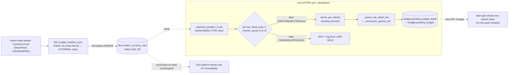

# Feature Design — Auto Re-persist Per-Diem on Master FX Change

Status: DRAFT (Mode A — pre-dev). Owner of build: 05-software-developer.
Author: Solution Architect. Date: 2026-07-24.
Related: ADR-0005 (per-diem/trip), ADR-0011 (FX snapshot — superseded), ADR-0013
(edit-rights-by-status/lock), ADR-0015 (recompute-on-read), ADR-0018/0022 (masters →
SharePoint Excel → Fabric sync). No production code in this document.

---

## 0. Verdict (one paragraph)

Today per-diem is recompute-on-read only (ADR-0015): after an admin changes the year's
USD→THB rate, the trip **subform** shows the new number (it re-derives on every read), but
the **stored** per-diem line in `budget.pending_budget_detail` and the parent cell in
`budget.pending_budget` keep the OLD number until the trip is re-saved — so the **main grid**,
which renders the stored snapshot, lags. jakkaritw wants the stored DB value to follow FX
automatically. The clean way to do that in this codebase is a **new idempotent batch job**
(`backend/jobs/repersist_perdiem_fx.py`) that, for one fiscal year, re-derives every affected
trip's per-diem with `derive_per_diem` (the existing single source of the formula) and re-writes
it with the existing `write_model` internals (`_upsert_trip_detail_line` + `_recompute_parent_cell`),
**skipping any department that is mid-approval or APPROVED** (never-cut lock, ADR-0013). No new
in-app "save FX" endpoint exists to hook, because the FX rate is not edited in this app at all —
see §2.

---

## 1. Context (plain language)

- **Problem:** an FX edit does not reach the stored budget numbers; the grid shows stale
  per-diem until each trip is manually opened + re-saved. jakkaritw wants "edit the year's FX →
  every affected trip's stored per-diem updates by itself."
- **Who benefits:** Fillers and approvers looking at the **main grid** see the correct
  FX-based per-diem without re-opening every trip; the dashboard/Gold layer (Phase 2) reads a
  consistent stored value.
- **Concrete example:** FY2027, an overseas trip = 5 days × 100 USD/day at FX 35 → 17,500 THB
  stored across the travel months. Admin changes FY2027 FX to 40. Target: the stored per-diem
  becomes 5 × 100 × 40 = 20,000 THB automatically, and the grid shows 20,000 on its next load —
  **provided that trip's department is still DRAFT/REJECTED** (not locked by approval).

---

## 2. Central discovery — WHERE/HOW `dbo.master_currency_rate` is edited today (with evidence)

**Confirmed answer: option (b) — SharePoint Excel → external Fabric sync notebook → `dbo.master_currency_rate`.
Options (a) and (c) are rejected by file evidence.**

| Candidate | Verdict | Evidence |
|-----------|---------|----------|
| (a) master-tables SWA "Master Currency" editor | **REJECTED — dead mockup, never wired** | `03-edit-master-table/master-tables/01frontend/master-currency.html` exists, but `02backend/modules/` contains ONLY `gl_group`, `orgcode_costcenter`, `hide_document` — there is no currency handler/route. ADR-0018 §Context: "Budget Closing Date and Master Currency stayed frontend-only mockups with no DB wiring." ADR-0018 retires the whole module. |
| (b) SharePoint Excel → Fabric sync | **CONFIRMED — this is the edit path** | ADR-0018 dataset #4 "Master Currency" = the Excel workbook `อัตราแลกเปลี่ยนเฉลี่ยรายปี.xlsx` (ADR-0015 update 2026-07-13), library "Budgeting and Management", site CMANDWPRD. It is synced into `dbo.master_currency_rate` in the ONE Fabric SQL DB (`fabric_sql_database`) by notebook **`NB_budget_masters_sync`** (+ `budget_masters_lib`) living in a **separate Fabric workspace `cman-dw-ws`** (`adeb7108-…`) — NOT in this repo (ADR-0022; project memory `reference_dw_budget_masters_sync`). The sync is a full-replace MERGE (`WHEN NOT MATCHED BY SOURCE THEN DELETE`) keyed per table. |
| (c) direct DB only | **REJECTED — app never writes it** | Grep of all `**/*.py`: the only code reference to the table is a READ — `SELECT usd_thb FROM dbo.master_currency_rate WHERE fiscal_year = ?` (`backend/app/write_model.py:1164`, `_lookup_fx`). Zero INSERT/UPDATE anywhere. CONTEXT.md: `dbo` = "read-only sync data; written by scripts/pipelines, app only reads". |

**Consequence for the trigger (critical):** the actual write to `dbo.master_currency_rate`
happens in a PySpark notebook in a **different Fabric workspace/repo** that this app does not
own or deploy, and that notebook has no access to this app's Python `derive_per_diem`. There is
**no in-app save endpoint to hook** (option (i) "hook the write path" would mean cross-repo
coupling into the DW notebook). So the re-persist must be its own thing that this app owns:
a job (recommended) or a manual admin endpoint. See §5.

**Note on schema name:** the LIVE code and this feature use `dbo.master_currency_rate`
(Fabric SQL DB). Older docs/mockups say `cfg_master.master_currency_rate` — that plan is dead
(ADR-0018). Do not build against `cfg_master`.

---

## 3. Assumptions

1. `dbo.master_currency_rate` has one row per `fiscal_year` with column `usd_thb`
   (verified via `_lookup_fx`, `write_model.py:1161-1168`). One rate per year (ADR-0015). **[CONFIRMED]**
2. `budget.budget_trip` stores everything the re-derive needs without a traveler re-lookup:
   `cost_center, fiscal_year, position (=job_level), country_group, days, travel_months (CSV),
   side` (verified `_TRIP_COLUMNS`, `subform_read.py:41-44`). So a traveler who has since left
   the company does not break re-pricing. **[CONFIRMED]**
3. Per-diem GL is `PER_DIEM_GL_BY_SIDE[side]` and the detail line is keyed `(trip_id, gl_account)`
   (verified `_upsert_trip_detail_line`, `write_model.py:1171-1213`). **[CONFIRMED]**
4. Department for the lock check is resolved from `cost_center` via `dbo.cc_filler_map`
   (`_lookup_cc_dims`), and lock status from `budget.approval_status` via
   `_lookup_department_approval_status` (`write_model.py:427-440`). **[CONFIRMED]**
5. The FX rate in `dbo.master_currency_rate` is already updated (by the DW sync) BEFORE the
   re-persist runs — the job reads the CURRENT rate; it does not itself change FX. **[NEEDS CONFIRMATION — ordering/timing with the DW sync]**
6. `derive_per_diem` (`backend/app/per_diem.py`) is the ONLY formula and stays the single source —
   the job must reuse it, never re-implement the split/rounding. **[CONFIRMED — hard rule]**

---

## 4. Re-persist algorithm (reusing existing functions — no formula duplication)

New internal helper in `write_model.py` (owns per-diem persistence — EXTEND, don't create a
parallel module). It is literally the tail of `_save_one_trip` (`write_model.py:1331-1447`)
minus the trip-header write:

```
repersist_trip_per_diem(conn, trip_row, fx_rate, rate_row, user_email, now):
    # trip_row: dict from a batch SELECT of budget.budget_trip (position, country_group,
    #           days, travel_months CSV, side, cost_center, fiscal_year, trip_id)
    months     = derive_per_diem(days, country_group, rate_row, fx_rate, travel_months)   # ADR-0015 formula, unchanged
    per_diem_gl = PER_DIEM_GL_BY_SIDE[side]
    _upsert_trip_detail_line(conn, trip_id, cost_center, per_diem_gl, fiscal_year, months, user_email, now)
    dims = _derive_dim_snapshot(conn, cost_center, per_diem_gl)
    _recompute_parent_cell(conn, cost_center, per_diem_gl, fiscal_year, dims, user_email, now)
```

Job orchestration in `backend/jobs/repersist_perdiem_fx.py` (same pattern as `auto_submit.py`):

```
run(fiscal_year, dry_run):
    with get_fabric_conn() as conn:
        fx = _lookup_fx(conn, fiscal_year)
        if fx is None:                                  # FX row deleted / missing (§8 edge)
            FAIL LOUD, abort — re-persist nothing (never silently skip every overseas trip)
        rate_matrix = SELECT job_level, rate_domestic, rate_asian, rate_other FROM dbo.per_diem_rate   # batch once
        trips = SELECT ... FROM budget.budget_trip
                WHERE fiscal_year = ? AND country_group IN (2,3)      # domestic (1) uses FX=1 → skip, see §6
        repriced, skipped_locked, skipped_missing_rate = 0,0,0
        for trip in trips:
            dept = _lookup_cc_dims(conn, trip.cost_center)["department"]
            if _lookup_department_approval_status(conn, dept, fiscal_year) in (PENDING_1/2/3, APPROVED):
                skipped_locked += 1; log; continue      # NEVER-CUT lock (ADR-0013), §6
            rate_row = rate_matrix.get(trip.position)
            if rate_row missing / rate column NULL:
                skipped_missing_rate += 1; log LOUD; continue   # §8 policy Q3 (default: skip+report loud)
            if dry_run: log "[DRY-RUN] would re-price trip ..."; continue
            per-trip TRANSACTION:
                repersist_trip_per_diem(conn, trip, fx, rate_row, user_email="system:fx_repersist", now)
                conn.commit()          # per-trip isolation (matches _run_per_item), one failure never aborts the batch
            repriced += 1
        log summary(repriced, skipped_locked, skipped_missing_rate, total)
```

CLI + safety: reuse `jobs/common.py` (`--fiscal-year` required, `--execute` default dry-run,
`DRY_RUN` env belt-and-braces). No auto-detect of "current year".

---

## 5. Trigger — recommendation + alternatives (decision at GATE)

**RECOMMENDED — (iii) a batch job in `backend/jobs/`, run after the FX sync.**
- Reuses the exact proven pattern (`auto_submit`/`auto_escalate`/`send_reminders`): CLI, dry-run
  default, `get_fabric_conn`, GitHub Actions `workflow_dispatch` now / cron after go-live.
- Idempotent (re-derive is deterministic) → safe to re-run.
- No new UI, no cross-repo notebook coupling, no websocket.
- Wire as one more step in `.github/workflows/budget-automations.yml` (same `fiscal_year` input),
  OR its own workflow triggered right after the masters sync. Timing dependency: must run AFTER the
  DW sync has landed the new rate (§3 assumption 5).

**Alternative (ii) — MANUAL admin button "อัปเดต FX" → new endpoint `POST /admin/fx-repersist?fiscal_year=Y`.**
- New router + admin-only auth (`ADMIN_EMAILS`) + a small admin control in the FE. Gives an admin
  immediate, deliberate control + feedback (matches ADR-0015 governance "only admins, deliberate").
- More build than (iii) and duplicates the job's `run()`. Best offered LATER as a thin wrapper that
  calls the same `run()` if jakkaritw wants an in-app button.

**Alternative (i) — AUTO, hook the FX write path.**
- Not clean here: the write path is the DW notebook `NB_budget_masters_sync` in workspace
  `cman-dw-ws` (external). Closest real option = have that notebook fire a GitHub
  `repository_dispatch` to launch the job after the currency file changes. Flag as a FUTURE
  enhancement on top of (iii), not Phase-1.

**Frontend consequence:** the main grid reads the stored value on its next `GET /budget` fetch —
so the new number appears on reload/re-open. **No FE change and no live-push are required.**
Optional (not in scope): an admin confirmation toast after running the job. The subform already
shows the new FX immediately (recompute-on-read, unchanged).

---

## 6. Financial + lock correctness (NEVER-CUT)

- **Lock skip (ADR-0013):** re-persist ONLY trips whose `(department, fiscal_year)` is in
  `DRAFT` / `REJECTED` / no-approval-row. **SKIP** any department in `PENDING_APPROVER1/2/3` or
  `APPROVED` — a background re-price must never silently change numbers an approval already
  covers (only Submit/Approve/Reject may move approved figures). The job is NOT an admin override;
  it is a stored-value refresh, so it respects the lock (it does NOT reuse the admin-bypassing
  `_ensure_department_not_locked` — it checks status and `continue`s).
- **Domestic (country_group=1):** per-diem uses FX=1, so a USD-rate change cannot affect it.
  These trips are **intentionally NOT touched** (query filters `country_group IN (2,3)`) — a no-op
  either way, skipped for clarity/performance. (Declared as out-of-scope, not "missed".)
- **Amounts to the cent, sum(months)==total_year, last-month remainder:** all preserved because
  the job calls the SAME `derive_per_diem` (floor non-last months, last month absorbs remainder;
  `per_diem.py:105-123`) and `_upsert_trip_detail_line`/`_recompute_parent_cell` set
  `total_year = SUM(m01..m12)` in one atomic statement (`write_model.py:807-833`). No new rounding
  path is introduced.
- **Audit:** every write stamps `_user="system:fx_repersist"` + `_updated_at` (mirrors
  `AUTO_ESCALATE_ACTOR_EMAIL="system:auto_escalate"`), so a post-hoc "why did this per-diem move"
  is answerable = "the year's FX was re-persisted by the job on <date>". Structured stdout log lists
  every trip re-priced (trip_id, cost_center, department, old→new total) and every skip + reason.

---

## 7. Idempotency, performance, concurrency

- **Idempotency:** deterministic — same FX + same trip inputs → identical months. Re-running writes
  the same value; no double-count (`_upsert_trip_detail_line` UPSERTs by `(trip_id, gl_account)`,
  never appends).
- **Batching:** ONE `_lookup_fx` per run; ONE read of the whole `dbo.per_diem_rate` matrix into a
  dict keyed by `job_level`; ONE `budget.budget_trip` scan for the year. Per trip = 2 small writes
  (upsert detail + recompute parent) + 1 status lookup. (Optional optimization: batch the
  department→status map once instead of per-trip.)
- **Volume estimate:** production is NOT live yet (go-live end Aug 2026) and the budget txn tables
  were truncated 2026-07-20, so a live count now = test residue, not representative — **no live
  count was run** (it would mislead sizing). Order-of-magnitude estimate from domain data
  (~99 fillers, overseas travel a subset): tens to low-hundreds of overseas trips/year; even at
  1,000 trips the job is a few thousand statements = seconds. Build-time exact count:
  `SELECT COUNT(*) FROM budget.budget_trip WHERE fiscal_year = ? AND country_group IN (2,3);`
- **Concurrency (optimistic lock):** the per-diem detail line + parent cell have NO
  `_updated_at` guard in the re-persist path (same as `_save_one_trip`'s tail — the aggregate is
  never user-locked, and the per-diem line is system-managed). The job re-derives from the CURRENT
  stored trip header, so it always reflects the latest committed `days/months/side/position`. The
  only residual race: a user commits a trip-header edit between the job reading that trip row and
  its detail write — last-writer-wins on the per-diem line. Because the value is deterministic, the
  user's own next save (or a job re-run) self-corrects, and most active editing pushes the
  department into PENDING (which the lock skip already excludes). Recorded as a KNOWN, low-severity
  risk (§11).

---

## 8. Edge cases

| Edge | Behavior | Rationale |
|------|----------|-----------|
| FX row for the year deleted / missing | **FAIL LOUD — abort the whole run**, re-persist nothing | Matches `per_diem.py` fail-loud; silently skipping every overseas trip would look like a "0 re-priced" success and hide a config error. (Also: a missing rate is not a meaningful "change" to propagate.) |
| FX changed for a year with 0 trips | No-op, log "0 trips", exit 0 | Nothing to do. |
| Trip position has no `per_diem_rate` row / NULL rate column (`MissingPerDiemRateError`) | **SKIP that ONE trip + log LOUD** in an error summary; continue others; non-zero exit if any skipped | A single unconfigured job_level must not block re-pricing everyone else, but must be visible (mirrors `fetch_trips`' per-trip error philosophy). **← policy Q3** |
| Department mid-approval / APPROVED | **SKIP + log** | Never-cut lock, §6. |
| Domestic trip (country_group=1) | **SKIP (filtered out)** | FX=1, unaffected. |
| User concurrently deletes the trip | Job's per-trip transaction reads the header fresh; if gone → skip. Small race window → orphan line possible, cleaned by the trip's own delete-cascade / next re-run | Low severity, idempotent recovery. |
| Locked department's subform vs grid | Subform shows NEW FX (recompute-on-read), grid shows OLD FX (stored, not re-persisted) | Accepted narrower version of today's lag — **← policy Q1 (ADR-0015 tension)**. |

---

## 9. Architecture



---

## 10. Task breakdown for 05 (each ≤ 4h; TDD — tests first)

1. **[DEV] Extract `repersist_trip_per_diem` helper in `write_model.py`** from `_save_one_trip`'s
   tail (derive → upsert detail → recompute parent). Unit test: given a trip row + FX + rate_row,
   the persisted months equal `derive_per_diem` and `total_year==SUM(months)`. (~3h) — no deps.
2. **[DEV] Add lock-aware skip helper** (`_department_locked(conn, dept, fy)` wrapping
   `_lookup_department_approval_status` ∈ `_LOCKED_APPROVAL_STATUSES`). Unit test each status →
   locked/not-locked. (~1.5h) — dep: none.
3. **[DEV] New job `backend/jobs/repersist_perdiem_fx.py`** (uses `jobs/common.py`, `get_fabric_conn`,
   batch FX + rate matrix + trip scan `country_group IN (2,3)`, per-trip txn, dry-run). Unit tests
   with a mocked conn: repriced/skipped-locked/skipped-missing-rate counts; FX-missing → abort;
   0-trips → 0. (~4h) — deps: 1, 2.
4. **[DEV] Structured logging + run summary + synthetic `_user="system:fx_repersist"`**; non-zero
   exit when any trip skipped for missing-rate. (~1.5h) — dep: 3.
5. **[OPS] Wire into `.github/workflows/budget-automations.yml`** as a new dry-run-default step (or
   its own workflow), `workflow_dispatch` `fiscal_year` input; keep cron commented until go-live.
   (~1.5h) — dep: 3.
6. **[QA] Integration/differential test** on the staging DB (Easy-Auth-OFF window technique): seed
   overseas trips across DRAFT/PENDING/APPROVED depts, change FX, run job, assert stored per-diem
   updated for DRAFT/REJECTED only, untouched for PENDING/APPROVED, sum parity holds. (~4h) — deps: 3,5.
7. **[REV+SEC] Combined gate** (06+07+08 checklists): financial sum/parity reconcile, lock rule,
   no-secret-inline, idempotency. (~2h) — dep: 6.
8. **[DOC] Update ADR** — supersede/annotate ADR-0015's "re-prices ALL incl APPROVED immediately"
   with the confirmed policy (depends on Q1 answer); add the job to project-context module inventory.
   (~1h) — dep: GATE decision.

Add these to `.claude/plan.md` only AFTER GATE approval (do not pre-load unapproved work).

---

## 11. Risks + rollback

- **R1 — ADR-0015 policy conflict (HIGH, policy not technical).** ADR-0015 explicitly accepted
  "FX edit re-prices ALL overseas per-diem incl APPROVED, every department." The never-cut lock in
  this task says skip APPROVED. These disagree for the STORED value. Default here = skip (safer,
  never-cut). Must be resolved at GATE (Q1) and ADR-0015 annotated. Mitigation: the guard is one
  `continue`; flipping the policy is a one-line change.
- **R2 — timing vs DW sync (MED).** If the job runs before the sync lands the new rate, it
  re-persists the old value (harmless, but the "update" appears not to happen). Mitigation: run
  strictly after the sync; document the ordering; job is re-runnable.
- **R3 — concurrent edit race (LOW).** §7 — last-writer-wins on the per-diem line; deterministic
  value + re-run self-corrects. Mitigation: per-trip fresh read; lock skip removes most active edits.
- **R4 — silent no-op scope creep (LOW).** Someone later "fixes" the domestic skip or the
  fail-loud-on-missing-FX. Mitigation: both are documented as deliberate (§6, §8).
- **Rollback:** the job only writes derived per-diem values that recompute-on-read already displays;
  to undo, re-run with the prior FX, or leave it — the next legitimate trip save re-derives anyway.
  No schema change, so nothing to migrate back.

---

## 12. OPEN POLICY QUESTIONS (GATE — jakkaritw decides)

- **Q1 (the big one) — do APPROVED / mid-approval departments get their STORED per-diem re-persisted?**
  Task's never-cut rule = NO (skip). ADR-0015 = YES (re-price everything incl APPROVED). Default in
  this design = **skip locked**. If skip wins: for approved departments the subform will show the new
  FX (recompute-on-read) while the grid keeps the old stored value — a small, deliberate
  inconsistency, and ADR-0015 needs a superseding note. If jakkaritw wants APPROVED re-priced too,
  it violates ADR-0013's lock and needs an explicit exception. **Which wins?**
- **Q2 — trigger: scheduled job (recommended) vs manual admin button vs auto-on-sync?**
  Recommended = job (dispatch now, cron after go-live). Do you also want an in-app "อัปเดต FX" button
  now, or is the job enough for Phase-1?
- **Q3 — a trip whose job_level has no `per_diem_rate`: skip-and-report-loud (recommended) vs
  fail-the-whole-run?** Recommended = skip that one trip, log loudly, non-zero exit — so one
  unconfigured level never blocks re-pricing everyone else, but it stays visible.
- **Q4 — domestic (country_group=1) trips: confirm NOT touched.** They use FX=1 so a USD-rate change
  can't affect them; the design skips them. Confirm this is intended (it is a no-op either way).
